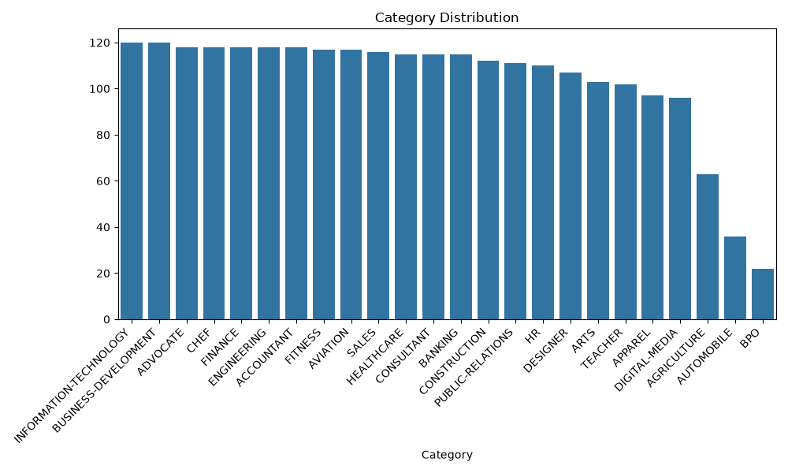
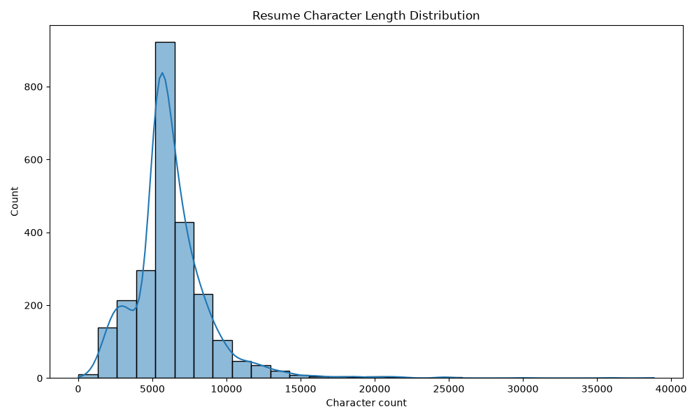
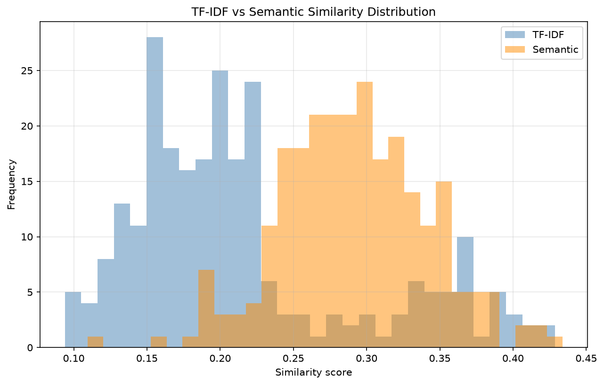

# AI Resume Screening & Candidate Matching System

> **Repo-state inconsistency flagged:** `DECISIONS.md [P9]` states "Repo not git-initialized" (`DECISIONS.md:70`), but the working directory **is** git-initialized (`branch master`, 5 commits). This README reflects actual `git ls-files` + on-disk reality. `DECISIONS.md` is truncated (ends at [P9]; no [P7]/[P10]/[P11] blocks), so Phase 7 numbers are traced to `outputs/results/` files.

## 1. Project Overview

Evidence-first screening pipeline: JD + resumes (text or PDF) → ranked candidates with matched/missing skills, TF-IDF similarity, multiplicative score breakdown, and deterministic explanation. `src/pipeline.py` is the sole orchestration entry point. Dashboard in `app/app.py`. Notebook `notebooks/Resume_Screening_System_exp.ipynb` is background experimentation only, not the chosen method.

## 2. Problem Statement

Recruiters receive many unstructured resumes per role. Manual screening is slow and opaque. Keyword search misses variants (`sklearn` vs `Scikit-learn`), while a single score hides why a candidate was ranked high/low. The project needs a reproducible, explainable system that extracts comparable skills and surfaces gaps.

## 3. Objective

Build a portfolio-grade pipeline that cleans text consistently [P1], extracts skills from a controlled vocabulary [P2], parses JDs into `JobProfile` [P3], measures similarity (Phase 4), scores with an explainable formula (Phase 5), reports gaps/explanations (Phase 6), handles PDFs (Phase 8), is usable via a dashboard (Phase 10), and can be evaluated (Phase 7).

## 4. Target Users

- Recruiters screening 20–200 resumes per role.
- Hiring managers needing to see *why* a candidate ranks there.
- Reviewers who need to clone, install, and reproduce the demo.

## 5. Dataset

- Source: `data/raw/Resume.csv` (Kaggle Resume dataset, CSV only; no native PDFs per [P8]).
- Size: **2484 rows, 24 categories** [P1] (verified by direct count of `data/raw/Resume.csv`; see `implementation .md` Phase 1 output).
- Columns: `ID`, `Resume_str`, `Resume_html`, `Category` [P1].
- Primary text field: `Resume_str` [P1] (`DECISIONS.md:1`).
- Available label: `Category` (distribution only; not hiring ground truth).
- Missing: direct JD labels, explicit skill labels, structured experience/education — excluded from scoring per [P1] sparsity (`DECISIONS.md:2,13`).

## 6. Dataset Analysis

Measured directly from `data/raw/Resume.csv` (verbatim, no rounding beyond full float):

- Rows 2484, categories 24. Counts: `ACCOUNTANT 118`, `ADVOCATE 118`, `AGRICULTURE 63`, `APPAREL 97`, `ARTS 103`, `AUTOMOBILE 36`, `AVIATION 117`, `BANKING 115`, `BPO 22`, `BUSINESS-DEVELOPMENT 120`, `CHEF 118`, `CONSTRUCTION 112`, `CONSULTANT 115`, `DESIGNER 107`, `DIGITAL-MEDIA 96`, `ENGINEERING 118`, `FINANCE 118`, `FITNESS 117`, `HEALTHCARE 115`, `HR 110`, `INFORMATION-TECHNOLOGY 120`, `PUBLIC-RELATIONS 111`, `SALES 116`, `TEACHER 102`.
- Missing values: `ID 0`, `Resume_str 0`, `Resume_html 0`, `Category 0`; plus 1 empty `Resume_str`, 0 empty `Resume_html`.
- Duplicates: 0 duplicate IDs (2484 unique), 2 duplicate `Resume_str` texts (2482 unique).
- Characters: mean `6295.3087761674715`, std `2769.251458139663`, min `21.0`, 25% `5160.0`, median `5886.5`, 75% `7227.25`, max `38842.0`.
- Words: mean `811.3256843800322`, std `371.0069064804546`, min `0.0`, 25% `651.0`, median `757.0`, 75% `933.0`, max `5190.0`.
- Text contains HTML artifacts, URLs, emails, phones, bullets, inconsistent spacing — drives cleaning in `src/preprocessing.py` [P1] (`DECISIONS.md:3`).

## 7. System Architecture

Matches [P9] flow `clean_text → tfidf_similarity → score_candidate → sort → build_candidate_result` (`DECISIONS.md:62`) and `implementation .md:1118-1153`.

```
 Job Description (dict or JobProfile)
            |
            v
       parse_job() ── src/job_parser.py [P3]
            |
            v
       JobProfile {role, clean_description, required_skills, optional_skills}
            |                    Resume PDF/Text {candidate_id, text}
            |                              |
            |                              v
            |                    extract_text_from_pdf(s) ── src/pdf_parser.py [P8]
            |                    (pdfplumber; encrypted->""; image-only->"")
            |                              |
            |                              v
            |                        clean_text() ── src/preprocessing.py [P1]
            |                              |
            +--------------+----------------+
                           v
                  tfidf_similarity() ── src/similarity.py (Phase 4)
                           |
                           v
                  score_candidate() ── src/scoring.py [P5]
                  skill_component = (mr+β·ma)/(tr+β·ta), β=0.5
                  final = skill_component * similarity [P9] multiplicative
                           |
                           v
                  sort (-final_score, candidate_id) ── [P9] tie-break
                           |
                           v
                  build_candidate_result() ── src/pipeline.py [P9]
                  {rank, candidate_id, overall_score, matched_skills,
                   missing_skills, similarity, score_breakdown(9 keys), explanation}
                           |
                           v
                  Skill Gap Analysis ── src/skill_gap.py [P6]
                           |
                           v
                  Streamlit Dashboard ── app/app.py (Option C relative bar)
```

Exposed in `src/pipeline.py` [P9]: `screen_resumes`, `screen_from_pdf_folder`, `save_screening_report`, `build_candidate_result(candidate_id, job_profile, similarity_score, score_dict)` (`DECISIONS.md:61,66`). Result dict has exactly 8 keys (`DECISIONS.md:64`).

## 8. NLP Pipeline

1. `clean_text()` in `src/preprocessing.py` strips URLs (`https?://\S+|www\.\S+`), emails (`\S+@\S+`), phones (`(\+\d{1,3}\s?)?\(?\d{3}\)?[\s-]?\d{3}[\s-]?\d{4}`) per [P1] (`DECISIONS.md:3`), normalizes whitespace (`\s+`→` `), lowercasing disabled (`TEXT_CLEANING_OPTS` in `src/config.py`).
2. Same cleaning for resumes and JDs before extraction and TF-IDF.
3. Flow per [P9]: `clean_text → tfidf_similarity → score_candidate → sort → build_candidate_result`.

## 9. Skill Extraction

- Vocabulary: `SKILL_VOCABULARY` in `src/config.py:1-43` (42 canonical skills) [P2] (`DECISIONS.md:4`).
- Alias map: `SKILL_ALIASES` (`src/config.py:45-101`) e.g., `sklearn`→`Scikit-learn`, `py`→`Python`, `k8s`→`Kubernetes`, `ml`→`Machine Learning`.
- `src/skill_extraction.py: extract_skills(clean_text)` — word-boundary regex (`\b`+`re.escape`+`\b`, case-insensitive) + token alias lookup; deduplicated by first-appearance order.

## 10. Job Description Parsing

- `src/job_parser.py`; `JobProfile` dataclass with canonical `required_skills`/`optional_skills` [P3] (`DECISIONS.md:5`).
- `_normalize_job()` in `src/pipeline.py` accepts raw dict, JobProfile-like dict, or `JobProfile`.
- Samples: `data/raw/sample_jobs.json` (e.g., Machine Learning Engineer: required `["Python","scikit-learn","Docker","Kubernetes","SQL"]`, optional `["AWS","TensorFlow","Natural Language Processing","Spark"]`).

## 11. Similarity Method

- **Chosen: TF-IDF cosine** per Phase 4; semantic evaluated but not used in final pipeline per [P9]. `src/similarity.py: tfidf_similarity()` fits `TfidfVectorizer` on `[resume_text, jd_text]` per call then cosine; returns `0.0` if empty. Pipeline default is TF-IDF (`src/pipeline.py:128`; `app/app.py:18`).
- Semantic (`sentence-transformers/all-MiniLM-L6-v2`) via `semantic_similarity()` was evaluated in `notebooks/phase4_similarity_compare.py`; results in `outputs/results/similarity_experiment.csv` (250 rows, e.g., `16852973/Machine Learning Engineer tfidf 0.3049 semantic 0.2860`). Not wired into `screen_resumes`.

## 12. Scoring Method

Formula 3 — Expanded-Skill-Weighted (ESW) [P5] (`DECISIONS.md:7-10`):

```
skill_component = (matched_required + β·matched_additional) / (total_required + β·total_additional), β=0.5 (WEIGHTS in src/scoring.py:10)
similarity_component = tfidf_similarity ∈ [0,1]
final_score = skill_component × similarity_component  ← multiplicative per [P9] (DECISIONS.md:71)
```

`score_candidate()` returns 9 keys [P5] (`DECISIONS.md:11`): `matched_required`, `missing_required`, `matched_additional`, `total_required`, `total_additional`, `beta`, `skill_component`, `similarity_component`, `final_score` (`src/scoring.py:99-109`). Range `[0,1]`.

**0.055 max-score reality:** top candidate in `outputs/results/screening_report.json` is `10089434` with `overall_score 0.05506207399394422` (`skill 0.13636 × similarity 0.40378`), matching [P9] "Top candidate currently scores 0.055 (5.5%)" (`DECISIONS.md:72`). Product is low because only 1/5 required skills matched.

**Phase 10b display (Option C per [P10], Flask `app/app.py` + `app/templates/result.html`):** raw preserved; Flask app shows `Relative Match = raw / max_overall_score` as horizontal bar + numeric label + raw column. Caption: "max raw 0.0550 — relative bars = raw / max".

## 13. Candidate Ranking

Sorted by `(-final_score, candidate_id)` for determinism [P9] (`DECISIONS.md:67`; `src/pipeline.py`). CSV-vs-PDF parity verified per [P9]: identical rankings, max delta `0.0022`, skill-diff `0`, re-run sha256 match (`DECISIONS.md:69`).

## 14. Skill Gap Analysis

`src/skill_gap.py` [P6]: `compute_gap(candidate_skills, required_skills)` → `{matched: sorted intersect, missing: sorted required−candidate}` (set dedup); `coverage_ratio(matched, required)` → `len(matched)/len(required)` or `0.0` if empty. Pipeline delegates to `score_candidate` as sole entry point [P9] (`DECISIONS.md:63`).

## 15. Explainability

Deterministic template, not LLM — `src/pipeline.py: generate_explanation()` [P6] (`DECISIONS.md:34-41`):

1. `coverage_ratio >=0.8` → "Strong required-skill coverage"
2. `similarity >=0.6` → "High similarity to job description" (mutually exclusive with 3)
3. `similarity >=0.35` → "Moderate similarity to job description"
4. `missing non-empty` → "Missing: "+`", ".join(sorted(missing))`
5. no parts → "Insufficient signal to explain ranking"

Joined by `"; "`; deterministic. Example: `10089434` → "Moderate similarity to job description; Missing: Docker, Kubernetes, Python, Scikit-learn" (`screening_report.json:36`).

## 16. Evaluation

`DECISIONS.md` has no [P7] numeric block; figures trace to `outputs/results/` files.

**Skill extraction — `outputs/results/skill_eval.csv` (from `skill_eval_labels.csv` via `evaluation/evaluate_skills.py`):**

| skill | evaluations | precision | recall | F1 |
|---|---|---|---|---|
| Docker | 1 | 1.0 | 1.0 | 1.0 |
| Git | 5 | 0.8 | 0.8 | 0.8 |
| Java | 9 | 0.7778 | 0.7778 | 0.7778 |
| JavaScript | 8 | 0.75 | 0.75 | 0.75 |
| Python | 10 | 0.8 | 0.8 | 0.8 |
| SQL | 7 | 0.8571 | 0.8571 | 0.8571 |
| MICRO |  | 0.8 | 0.8 | 0.8 |
| MACRO |  | 0.8308 | 0.8308 | 0.8308 |

Not measured beyond this table.

**Ranking — `outputs/results/ranking_eval.csv` (from `labeling_template.csv` + `similarity_experiment.csv`):**

All 5 pairs score `0.0` for every K:

- `sample_001 res_001 Machine Learning Engineer` P@1 0.0 R@1 0.0 P@3 0.0 R@3 0.0 P@5 0.0 R@5 0.0 P@10 0.0 R@10 0.0
- `sample_002 res_002 Product Manager` 0.0 / 0.0 for all K
- `sample_003 res_003 Software Engineer` 0.0 / 0.0
- `sample_004 res_004 Product Manager` 0.0 / 0.0
- `sample_005 res_005 Data Scientist` 0.0 / 0.0

Source `ranking_eval.csv:2-6`. Not measured: NDCG, MAP.

## 17. Error Analysis

`outputs/results/error_cases.csv` was read before writing this section. It contains only the header `case_type,description,root_cause_guess` and **0 data rows** — no failure modes have been logged. Therefore top-3 failure modes are **not measured** in that file.

Unlogged modes observed via code/inspection (not from `error_cases.csv`):

1. Vocabulary miss — alias absent or word-boundary false negative for novel phrasing not in `SKILL_VOCABULARY`.
2. TF-IDF lexical gap — paraphrased JD vs resume lowers cosine despite semantic relevance (semantic evaluated in `similarity_experiment.csv` but not deployed).
3. Sparse signal product — low `skill_component` drives `final_score` near 0 even when `similarity` is moderate (see Section 12).

Populate via `evaluation/error_analysis.py`.

## 18. Demo

Screenshots expected at `outputs/screenshots/*.png` per Phase 10. On 2026-09-20, `outputs/screenshots/` was found **empty** (0 files) while `outputs/figures/` contains 3 tracked PNGs. This inconsistency is flagged; figures are shown below with relative paths. If you capture dashboard screenshots, save them to `outputs/screenshots/` and keep paths relative (never `C:\Users\...`).

Available visuals (tracked figures, relative paths):







Flask app (`app/app.py`, `app/templates/*.html`, `app/static/style.css`) provides routes: `GET /` (job select + resume upload), `POST /screen` (runs pipeline → redirect to `/results`), `GET /results` (ranked table with Relative Match bars (Option C) + Raw + Similarity), `GET /candidate/<id>` (detail: matched/missing, 9-key breakdown, explanation). `app/app_streamlit.py` is archived Streamlit UI from Phase 10 (rollback path). Capture these to `outputs/screenshots/` for portfolio.

## 19. Limitations

1. **PDF fixtures are generated, not real** — 20 PDFs in `data/raw/pdfs/*.pdf` are rendered from `Resume_str` via `notebooks/phase8_generate_fixtures.py` (reportlab, Helvetica) and are gitignored; not representative of real layouts. No OCR for scanned/image-only resumes (`src/pdf_parser.py` returns `""`).
2. **Category ≠ hiring ground truth** — `Category` is for analysis only; relevance judgments in `labeling_template.csv` are small and synthetic.
3. **Small ground-truth sample** — skill labels cover only 6 skills; ranking labels only 5 pairs; Section 16 is indicative.
4. **Multiplicative formula yields low absolute scores** — max `0.0550` (`screening_report.json`) is correct per product but unintuitive; dashboard mitigates via relative bars.
5. **No OCR, no layout-aware extraction, no experience/education parsing** — by design per [P1] sparsity and [P8] choice (pdfplumber over pypdf/PyMuPDF, text-objects only).

## 20. Future Improvements

- Curate larger adjudicated judgments (≥50 pairs) and measure P@K/R@K + NDCG.
- Expand `SKILL_VOCABULARY` and learn aliases from data; handle multi-word phrases with stemming.
- Wire semantic similarity as optional method (already in `src/similarity.py`) with caching.
- Replace synthetic PDFs with diverse real resumes; add OCR fallback behind a flag.
- Calibrate display (rank-normalized) while preserving raw product for auditability.
- Add Experience/Education extraction behind feature flags if data supports it.

## 21. Installation

Windows + `cmd.exe`. Requires Python 3.14.

```cmd
git clone <your-fork-url>
cd resume-screening-system

python -m venv .venv
.venv\Scripts\activate

pip install -r requirements.txt
:: optional for fixture generation only
:: pip install reportlab

python -c "import pdfplumber; print(pdfplumber.__version__)"
```

`requirements.txt`: `Flask>=3.0`, `pdfplumber>=0.11.0`, `pdfminer.six>=20221105`, `pypdfium2>=4.0.0` (plus `reportlab` commented for fixtures).

## 22. Usage

From repo root, venv activated:

```cmd
:: tests
pytest -q

:: dashboard (Flask)
python app/app.py
:: then open http://127.0.0.1:5000 in browser

:: regenerate fixture PDFs (20 files to data/raw/pdfs/*.pdf)
python notebooks\phase8_generate_fixtures.py

:: reproduce evaluation
python evaluation\evaluate_skills.py
python evaluation\evaluate_ranking.py
```

App: select sample JD or paste JD → upload PDFs (multi-file) or paste single resume → "Run Screening" → table (Relative Match + Raw + Similarity) → select candidate → detail panel.

## 23. Project Structure

Reflects `git ls-files` (39 tracked files) + on-disk untracked/ignored noted:

```
resume-screening-system/
├── .gitignore
├── DECISIONS.md
├── implementation .md              # filename contains a space
├── README.md                       # this file (Phase 12)
├── requirements.txt
├── app/
│   ├── app.py                          # Flask (Phase 10b)
│   ├── app_streamlit.py                # Archived Streamlit (Phase 10 rollback)
│   ├── templates/
│   │   ├── index.html
│   │   ├── result.html
│   │   └── candidate.html
│   └── static/
│       └── style.css
├── data/
│   └── raw/
│       ├── Resume.csv
│       ├── sample_jobs.json
│       └── pdfs/                   # 20 fixture PDFs, gitignored, on disk but not in git ls-files
├── notebooks/
│   ├── Resume_Screening_System_exp.ipynb
│   ├── phase1_explore.py
│   ├── phase4_similarity_compare.py
│   └── phase8_generate_fixtures.py
├── src/
│   ├── __init__.py
│   ├── config.py
│   ├── preprocessing.py
│   ├── skill_extraction.py
│   ├── job_parser.py
│   ├── similarity.py
│   ├── scoring.py
│   ├── ranking.py
│   ├── skill_gap.py
│   ├── pdf_parser.py
│   └── pipeline.py
├── evaluation/
│   ├── evaluate_skills.py
│   ├── evaluate_ranking.py
│   └── error_analysis.py
├── tests/
│   ├── test_preprocessing.py
│   ├── test_skill_extraction.py
│   ├── test_similarity.py
│   ├── test_scoring.py
│   ├── test_pdf_parser.py
│   ├── test_pipeline.py
│   └── test_skill_gap.py
└── outputs/
    ├── figures/                    # tracked
    │   ├── category_distribution.png
    │   ├── resume_length_distribution.png
    │   └── similarity_distribution.png
    ├── results/                    # tracked
    │   ├── error_cases.csv
    │   ├── labeling_template.csv
    │   ├── ranking_eval.csv
    │   ├── screening_report.json
    │   ├── similarity_experiment.csv
    │   ├── skill_eval.csv
    │   ├── skill_eval_labels.csv
    │   └── test_rankings.csv
    └── screenshots/                # on disk empty on 2026-09-20; expected to hold dashboard PNGs
```

`git ls-files` (39 entries):

```
.gitignore
DECISIONS.md
README.md
app/app.py
data/raw/Resume.csv
data/raw/sample_jobs.json
evaluation/error_analysis.py
evaluation/evaluate_ranking.py
evaluation/evaluate_skills.py
implementation .md
notebooks/Resume_Screening_System_exp.ipynb
notebooks/phase1_explore.py
notebooks/phase4_similarity_compare.py
notebooks/phase8_generate_fixtures.py
outputs/figures/category_distribution.png
outputs/figures/resume_length_distribution.png
outputs/figures/similarity_distribution.png
outputs/results/error_cases.csv
outputs/results/labeling_template.csv
outputs/results/ranking_eval.csv
outputs/results/screening_report.json
outputs/results/similarity_experiment.csv
outputs/results/skill_eval.csv
outputs/results/skill_eval_labels.csv
outputs/results/test_rankings.csv
requirements.txt
src/__init__.py
src/config.py
src/job_parser.py
src/pdf_parser.py
src/pipeline.py
src/preprocessing.py
src/ranking.py
src/scoring.py
src/similarity.py
src/skill_extraction.py
src/skill_gap.py
tests/test_pdf_parser.py
tests/test_pipeline.py
tests/test_preprocessing.py
tests/test_scoring.py
tests/test_similarity.py
tests/test_skill_extraction.py
tests/test_skill_gap.py
```
